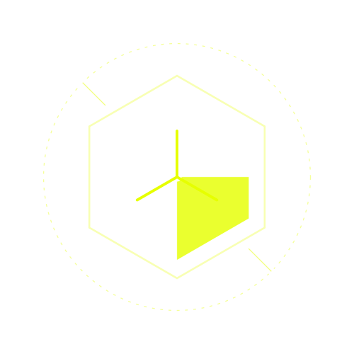

# Yash Ghodele - Portfolio V3

<div align="center">
  
</div>

> **Engineering meets Art.** A premium portfolio experience built to demonstrate full-stack mastery, creative design, and performance optimization.

[](https://nextjs.org/)
[](https://www.typescriptlang.org/)
[](https://tailwindcss.com/)
[](https://pages.cloudflare.com/)

---

## 💎 The Concept: "Premium Dark"

This is not just a collection of links. It is a **Curated Digital Experience**.
The design philosophy centers on immersion:

*   **Atmospheric Depth**: Uses a hybrid system of **Network Mesh** (Hero) and **Floating Data Particles** (Global) to create a sense of depth and activity without distracting from the content.
*   **Physics-Based Interaction**: Magnetic buttons, elastic swipe gestures, and spring-based animations (`framer-motion`) make the UI feel alive.
*   **Bespoke Layouts**: Unlike standard template portfolios, flagship projects like **Sanjivani V2** and **FuelShield** get **dedicated architectural routes**, allowing for unique presentation styles tailored to the project's brand.

---

## 🚀 Key Features

### 1. Bespoke Case Studies
High-ticket projects are not just text on a page. They are immersive experiences with custom layouts, specific animations, and branded assets.
*   **Sanjivani V2**: AI Crop Doctor (Bespoke Layout)
*   **FuelShield**: IoT Fuel Monitoring (Bespoke Layout)

### 2. Historical & Community Context
*   **Restored Archives**: **Sanjivani V1** is preserved to showcase the project's evolution and engineering journey.
*   **Community Leadership**: A dedicated **Community** section (formerly Events) highlighting leadership in tech clubs, hackathons, and cultural initiatives.

### 3. Performance First
*   **Edge-Ready**: Deployed to **Cloudflare Pages** for sub-100ms globally distributed latency.
*   **Zero-Layout Shift**: Fonts (`Inter`) are subsetted and preloaded. Images use `unoptimized` output for crisp rendering on static hosts.
*   **Privacy & Security**: SEO hardening (e.g., `robots.txt` exclusions) to protect sensitive assets like resumes.

---

## 🏗️ Architecture & Engineering

### The "Hybrid" Content Strategy
We use a sophisticated mix of **Static Markdown** and **React Server Components**:

*   **Data Layer (`content/projects/*.mdx`)**: Project metadata (titles, stacks, stats) is stored in MDX for easy portability and SSG injection.
*   **Presentation Layer (`app/projects/*`)**: Hardcoded routes for flagship projects, ensuring maximum design freedom.

### Interactive UI Core
*   **Swipe Gestures**: Custom-engineered mobile touch handlers for project navigation.
*   **Glassmorphism**: Real-time background blur filters used on cards and navigation to maintain context.
*   **React Context Free**: "Dark Mode" is baked directly into CSS variables for maximum performance, stripping unnecessary bundle size.

---

## ⚡ Tech Stack

| Domain | Technology | Rationale |
| :--- | :--- | :--- |
| **Framework** | **Next.js 14** (App Router) | Server Components (RSC) & File-system routing |
| **Styling** | **Tailwind CSS** + **Shadcn/ui** | Utility-first architecture with accessible primitives |
| **Motion** | **Framer Motion** | Complex orchestrations & layout transitions |
| **Content** | **MDX** + **Gray-matter** | Developer-friendly content management |
| **Email** | **Resend** | Reliable delivery for the contact form |
| **Deployment** | **Cloudflare Pages** | Edge network distribution & unlimited bandwidth |
| **Package Mgr** | **npm** | Standard dependency management |

---

## 📂 Project Structure

```bash
portfolio/
├── app/                  # Next.js App Router
│   ├── community/        # Community & Events Section
│   ├── projects/         # Bespoke Case Study Routes
│   │   ├── sanjivani-v2/ # Custom Layout for Sanjivani V2
│   │   └── sanjivani/    # Restored V1 Layout
│   ├── layout.tsx        # Global shell & SEO metadata
│   └── page.tsx          # Landing page composition
├── components/           # React Components
│   ├── ui/               # Shadcn/ui primitives & effects
│   └── active-project.tsx # Interactive components
├── content/              # MDX Data Source
│   └── projects/         # Raw project data files
└── lib/                  # Utilities (MDX parsers, cn helper)
```

---

## 🏁 Getting Started

Clone the repository and install dependencies:

```bash
git clone https://github.com/yash-ghodele/portfolio.git
cd portfolio
npm install
```

Run the development server:

```bash
npm run dev
# Open http://localhost:3000
```

Build for production (Cloudflare Pages):

```bash
npm run pages:build
# Output will be in .vercel/output/static or .next/
```

---

## 📄 License

MIT License © 2026 Yash Ghodele.
