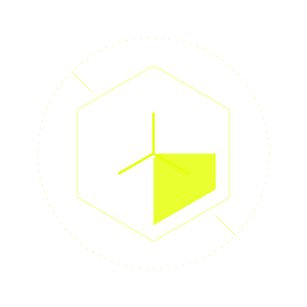

# Yash Ghodele - Portfolio V3

<div align="center">
  
</div>

> **Engineering meets Art.** A premium portfolio experience built to demonstrate full-stack mastery, creative design, and headless CMS architecture.

[](https://nextjs.org/)
[](https://www.typescriptlang.org/)
[](https://www.sanity.io/)
[](https://tailwindcss.com/)
[](https://pages.cloudflare.com/)

---

## 💎 The Concept: "Minimalist Authority"

This is not just a collection of links. It is a **Curated Digital Experience**.
The design philosophy centers on immersion:

*   **Atmospheric Depth**: Uses a hybrid system of **Hero Network** and high-contrast typography to create a sense of scale and precision.
*   **System-Driven Interaction**: Magnetic buttons, reveal-on-scroll orchestrations, and deterministic state management make the UI feel solid and responsive.
*   **Dynamic Theming**: Case studies and event chronicles feature data-driven layouts powered by **Sanity CMS**.

---

## 🚀 Key Features

### 1. Headless CMS Architecture (Sanity.io)
The portfolio is fully decoupled, with content managed via **Sanity Studio**:
*   **Projects/Work**: Rich text descriptions, impact metrics, and tech stacks.
*   **Events**: Dynamic cover images, roles, and attendance chronicles.
*   **Live Preview**: Real-time content synchronization.

### 2. High-Fidelity Chronicles
The platform transitions from simple project lists to immersive "Chronicles of Execution".
*   **Live Scoreboard**: Animated counters for key impact metrics.
*   **Execution Arsenal**: Highlighted technical and operational strengths.
*   **Timeline Architecture**: Vertical scroll-linked history of engagement.

### 3. Production Hardening
*   **Next.js 15+ Ready**: Full support for async route parameters and Turbopack.
*   **Hydration Safe**: Deterministic mounting patterns eliminate SSR mismatches.
*   **SEO Optimized**: Dynamic metadata and structured JSON-LD for all entities.

---

## 🏗️ Architecture & Engineering

### The "Unified" Route Strategy
We use a streamlined routing hierarchy for maximum SEO and performance:

*   **`/work`**: The central project hub.
*   **`/events`**: The community leadership chronicle.
*   **`/stack`**: Dedicated hardware/software arsenal page.
*   **`/about`**: Interactive bio and founder journey.

---

## ⚡ Tech Stack

| Domain | Technology | Rationale |
| :--- | :--- | :--- |
| **Framework** | **Next.js 15** | Server Components & Promise-based routing |
| **CMS** | **Sanity.io** | Headless content management |
| **Styling** | **Tailwind CSS** | Utility-first design system |
| **Motion** | **Framer Motion** | Complex scroll orchestrations |
| **Deployment** | **Cloudflare Pages** | Global edge distribution |

---

## 📂 Project Structure

```bash
portfolio/
├── app/                  # Next.js App Router
│   ├── events/           # Event Chronicle (Dynamic)
│   ├── work/             # Unified Project Hub
│   ├── stack/            # Tech Arsenal Page
│   ├── about/            # Interactive Bio
│   ├── journal/          # Engineering Blog
│   ├── studio/           # Embedded Sanity Studio
│   ├── layout.tsx        # Global shell & SEO
│   └── page.tsx          # Landing page (Bento)
├── components/           # React Components
│   └── ui/               # Design system primitives
├── sanity/               # CMS Configuration
├── lib/                  # Fetch clients & Types
└── public/               # Static Assets
```

---

## 🏁 Getting Started

```bash
git clone https://github.com/yash-ghodele/portfolio.git
npm install
npm run dev
```

---

## 📄 License

MIT License © 2026 Yash Ghodele.
