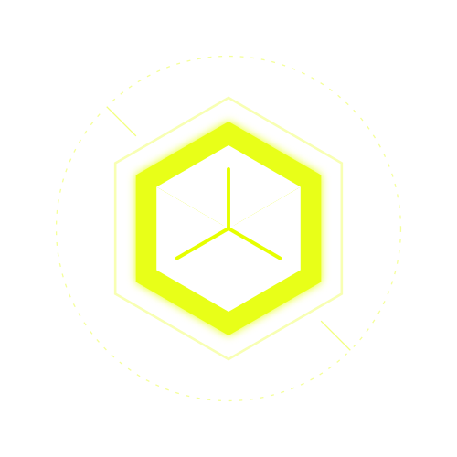

# Yash Ghodele — Portfolio V3

<div align="center">
  
</div>

> **Engineering Meets Art.** A modern digital engineering portfolio built to showcase full-stack web applications, IoT embedded systems, fintech security protocols, and event production systems.

[](https://nextjs.org/)
[](https://www.typescriptlang.org/)
[](https://tailwindcss.com/)
[](LICENSE)

---

## ⚡ Flagship Systems & Engineering Portfolio

### 🛡️ 1. AuthoSec — Fintech Security & Dual-QR Protocol
* **Domain**: Cryptographic Payment Security & Identity Authentication
* **Architecture**: Next.js 15, Prisma ORM, Supabase PostgreSQL, AWS SNS SMS OTP, AES-256 GCM, Expo Mobile
* **Key Innovations**:
  * **Dual-QR Handshake Protocol (QR1 → QR2)**: Eliminates replay attacks, static QR swap fraud, and identity spoofing.
  * **Sub-300ms Core Verification**: Core handshake latency executed under 300ms with 2-4s AWS SNS OTP delivery.
  * **Peer-Reviewed IEEE Academic Integration**: Complete 66-page IEEE standard report PDF available directly within the interface (`/reports/authosec-academic-report.pdf`).

### ⚙️ 2. Ugam Campus Product Projects
Commercial & industrial engineering systems developed under the Ugam Campus initiative:
* **Smart Garbage — Automated Segregation Engine**: Active IR proximity detection, 5-sample analog moisture sampling (A0), and SG90 servo chute routing (20° Wet vs 160° Dry) executed under 50ms.
* **ESP Car — Wi-Fi Telemetry Vehicle**: ESP8266 NodeMCU V3 SoC, L293D dual H-bridge motor driver, and sub-20ms Blynk IoT Virtual Pin socket packet stream controls (`V0`–`V4`).

### ⛽ 3. FuelShield — IoT Fuel Theft & Fleet Telemetry
* **Domain**: Heavy Fleet Operations & Fluid Telemetry
* **Tech Stack**: ESP32, MQTT, Firebase Realtime DB, High-Precision Ultrasonic Liquid Level Sensors
* **Performance**: Sub-second fuel siphoning detection and immediate mobile alert dispatcher.

### 🌿 4. Sanjivani & Sanjivani v2 — Agro-Tech Intelligence
* **Domain**: Precision Agriculture & Automated Hydroponics
* **Features**: Environmental sensor matrix, soil NPK analysis, automated fertigation dosing, and crop health diagnostic models.

### 🏢 5. Enterprise B2B Systems & Automation
* **Smart CRM**: High-throughput automation engine replacing manual spreadsheet bottlenecks with RAM-based ADODB processing for 100k+ B2B leads per session.
* **WireFlow & LocalMD**: Visual workflow builders and local markdown document processing tools.

---

## 🏗️ Architecture & Engineering Design

```
Portfolio System Architecture
├── app/                      # Next.js App Router
│   ├── (home)/               # Landing page with interactive Bento layout
│   ├── work/                 # Project Hub & Dynamic Template Router (/work/[slug])
│   ├── events/               # Event Leadership & Hackathon Chronicles
│   ├── journal/              # Technical Writing & Engineering Essays
│   ├── stack/                # Interactive Hardware & Software Tech Stack
│   ├── about/                # Interactive Bio & Timeline Architecture
│   ├── layout.tsx            # Global metadata, SEO schema & shell
│   └── sitemap.ts            # Dynamic XML sitemap generator
├── components/               # UI Design System & Component Library
│   ├── projects-templates/   # Dedicated custom project case study pages
│   ├── event-templates/      # Event recap templates (Innohack, Virasat)
│   └── ui/                   # Primitive design components (Shadcn/Tailwind)
├── lib/                      # Type-safe static data schemas & metadata stores
└── public/                   # Media assets, screenshots & PDF academic reports
```

---

## 🛠️ Tech Stack & Tooling

| Layer | Technologies Used |
| :--- | :--- |
| **Frontend Core** | Next.js 16 (App Router), React 19, TypeScript, Tailwind CSS |
| **Design System** | Lucide React, Glassmorphism UI, Custom HSL Color Systems |
| **Motion & FX** | Tailwind CSS Animations, Smooth Scroll Target Anchors |
| **Embedded & Hardware** | C++, Arduino IDE, ESP32, ESP8266 (NodeMCU), L293D, SG90, Sensors |
| **Backend & Cloud** | Node.js, Prisma ORM, Supabase PostgreSQL, Firebase, AWS SNS |
| **Documentation** | IEEE Standard Academic PDF Reports, Architectural Diagrams |

---

## 🏁 Quick Start & Local Execution

1. **Clone the repository**:
   ```bash
   git clone https://github.com/yash-ghodele/Portfolio.git
   cd Portfolio
   ```

2. **Install dependencies**:
   ```bash
   npm install
   ```

3. **Run the development server**:
   ```bash
   npm run dev
   ```
   Open [http://localhost:3000](http://localhost:3000) in your browser.

4. **Build production bundle**:
   ```bash
   npm run build
   ```

---

## 📄 License

MIT License © 2026 [Yash Ghodele](https://github.com/yash-ghodele).
